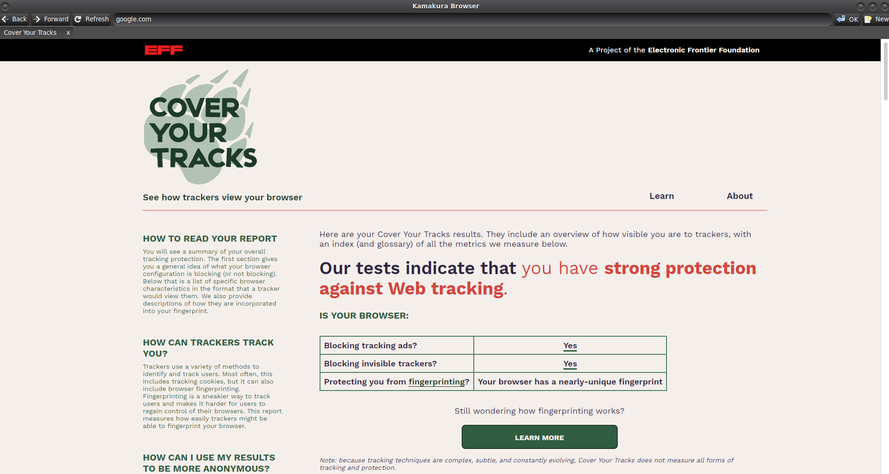

# Kamakura Browser

[](https://github.com/msbCyricTohoku/Kamakura-browser/actions)
[](LICENSE)
[](https://github.com/msbCyricTohoku/Kamakura-browser/issues)
[](https://github.com/msbCyricTohoku/Kamakura-browser/network)
[](https://github.com/msbCyricTohoku/Kamakura-browser/stargazers)


**Kamakura Browser** is a lightweight yet powerful browser written in C, focused on protecting your online privacy. It blocks intrusive trackers and avoids harvesting any user data, giving you full control over your web experience.



---

## Features

- **Lightweight:** Built with efficiency in mind, minimizing resource usage.
- **Privacy-first:** No data collection or user tracking. Ever.
- **Tracker Blocking:** Defends against known tracking domains to keep your browsing private.
- **Fast & Minimal:** Strips away unnecessary features to deliver a snappy, straightforward experience.
- **Open Source:** Everyone is free to inspect, modify, and distribute Kamakura Browser.

---

## Getting Started

### Prerequisites

- A C compiler (GCC, Clang, or any other standards-compliant compiler).
- [CMake](https://cmake.org/) 3.10 or higher (recommended).
- Basic development tools (make, etc.) depending on your platform.
- **GTK 3 development libraries** and **WebKitGTK 4 development libraries**.

Below are examples of how to install these on popular Linux distributions:

**Ubuntu / Debian**

```
sudo apt update
sudo apt install \
    build-essential \
    cmake \
    pkg-config \
    libgtk-3-dev \
    libwebkit2gtk-4.0-dev
```
**Arch**
```
sudo pacman -Syu
sudo pacman -S --needed \
    base-devel \
    cmake \
    pkgconf \
    gtk3 \
    webkit2gtk
```
**Redhat**
```
sudo dnf install \
    gcc \
    gcc-c++ \
    cmake \
    pkg-config \
    gtk3-devel \
    webkit2gtk3-devel
```

